# The Magical Token Machine

The "Magical Token Machine" presents an intriguing and novel gaming experience for those who dare to challenge fortune. This enthralling game permits participants to wager their tokens and place bets on up to five lines, thus amplifying the prospects of securing substantial rewards.

Prior to the commencement of the gameplay, participants are required to deposit their tokens into the machine. This represents the stake with which they will engage in the game. Participants have the liberty to wager on a maximum of five lines. Opting for multiple lines escalates the likelihood of triumph, albeit concurrently increasing the stake. A victory is ascertained when three homogeneous letters align sequentially on any of the wagered lines. For instance, a triumph is declared if the combinations A|A|A, B|B|B, C|C|C, or D|D|D materialize on any of the active lines. The magnitude of the reward is contingent on the number of lines wagered. The more lines wagered, the greater the reward. The reward is calculated by multiplying the number of lines wagered by the number of tokens wagered. For instance, if a participant wagers 5 tokens on 5 lines and secures a victory, they will be rewarded with more tokens.The manifestation of the 'E' symbol bestows participants with bonus tokens or even a rare additional spin. This element introduces a transformative potential to the dynamics of the game and injects an additional layer of excitement.

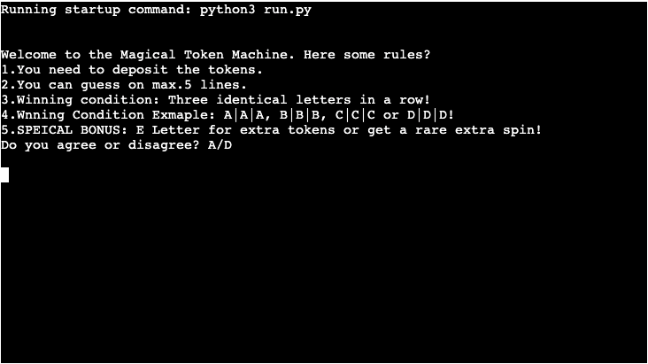

[View Magical Token Machine live project here](https://magical-token-machine-fbea0bb744c9.herokuapp.com/)

## Table of Contents
### [How to play](#how-to-play-1)
### [Logic Flowchart](#logic-flowchart-1)
### [User Experience (UX)](#user-experience-ux-1)
* [User Stories](#user-stories)
### [Features](#features-1)
* [Existing Features](#existing-features)
### [Features Left to Implement](#features-left-to-implement-1)
### [Design](#design-1)
### [Technologies Used](#technologies-used-1)
### [Frameworks, Libraries & Programs Used](#frameworks-libraries--programs-used-1)
### [Testing](#testing-1)
### [Manual Testing](#manual-testing-1)
### [Input validation testing](#input-validation-testing-1)
### [Fixed Bugs](#fixed-bugs-1)
### [Deployment](#deployment-1)
* [Deployment to Heroku](#deployment-to-heroku)
* [Forking the GitHub Repository](#forking-the-github-repository)
* [Local Clone](#local-clone)
### [Credits](#credits-1)
* [Code](#code)
* [Content](#content)
### [Acknowledgements](#acknowledgements-1)
---

## How to Play

Before engaging with the "Magical Token Machine," a player must accept the game's rules. Once agreed, they deposit their tokens and decide how many lines to wager on, each line offering a separate chance to win. After the stakes are set, the machine reveals the outcome, updating the player's token balance based on their victory or loss. Finally, the player can choose to either cash out their earnings or continue playing, diving back into the thrilling cycle of risk and reward.

## Logic flowchart

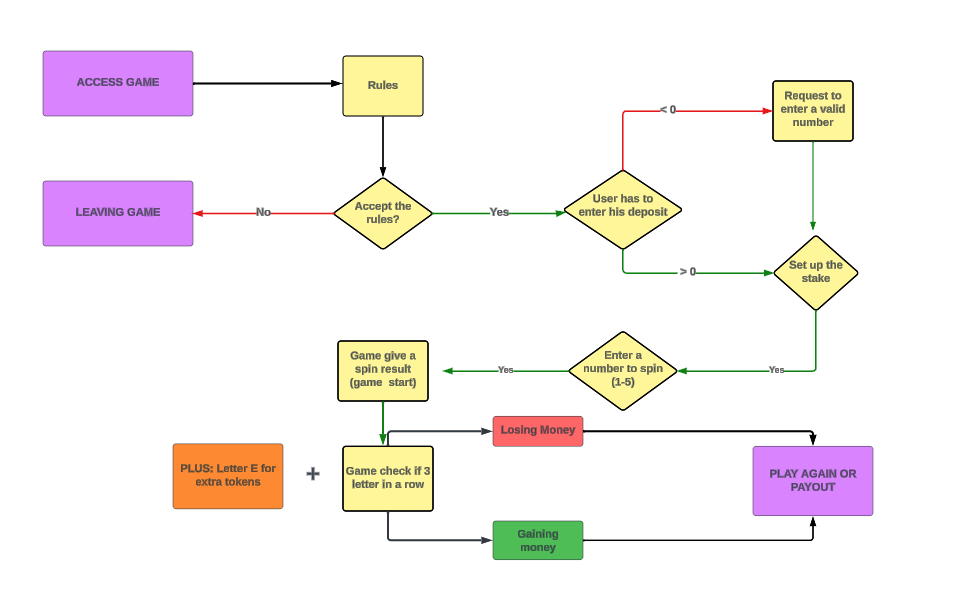

## User Experience (UX)

In the realm of the "Magical Token Machine," each player's journey starts with a nod of acceptance to the rules, setting the stage for the adventure. Depositing tokens, they feel the thrill of commitment, then strategize, choosing their lines to stake on—each a potential path to victory. The machine's reveal is a dramatic pause in time, updating the player's balance with wins or losses. Faced with the pivotal choice to cash out or reinvest, players are immersed in the gripping cycle of risk and reward, where every decision is a blend of strategy and anticipation in the captivating narrative of the game.

### User Stories

* First-time visitor goals
    * Understand how the game works. Clear instructions and what the objective of the game is.
    * Play the game. Once the user understands the game, they will likely want to play it.
    * Enjoy the experience. The Magical Token Machine should be engaging and fun for the user.

* Returning visitor goals
    * Continue playing. The returning visitor may have enjoyed playing the game and wants to play again.
    * Share with friends. Inviting friends to give the game a try.
    * Exploring new features, if there is any.

* Frequent user goals
    * Improving their token balance.
    * Playing the game for fun.
    * Can be palyed in spare time.
    * Exploring new features, if there is any.

---

## Features

* Rules. The game requires a mandatory display of its rules, and players must provide explicit consent or dissent to continue with the gameplay.
* Deposit features. Player can deposit their tokens into the machine.
* Stake amount. Player can choose how many tokens he wants to play.
* Lines wager. Player can choose how many lines he wants to play.
* Payout or play again feature. Player can choose to either cash out their earnings or continue playing, diving back into the thrilling cycle of risk and reward.
* Game statistics. Player can see how many tokens he won or lost.
* Play again at the end of the game.

### Existing Features

* Rules
    * Presentation of the game's rules is mandatory, and players must explicitly agree or disagree to proceed with the gameplay.

* After accepting the rules, the player have to deposit their tokens into the machine. This represents the stake with which they will engage in the game.

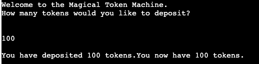

* The playet can now wager his tokens. With how many tokens he wants to play 

* The player can now wager on a maximum of five lines. He can chosse between 1 and 5 lines. Opting for multiple lines escalates the likelihood of triumph, albeit concurrently increasing the stake.

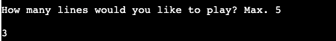

* Game shows results of the game. The player can see how many tokens he won or lost.

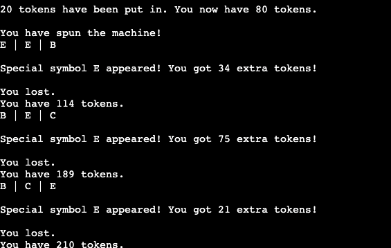

* Play again or payout feature. The player can choose to either cash out their earnings or continue playing, diving back into the thrilling cycle of risk and reward.

* Payout and statistics. The player can see how many tokens he won or lost.

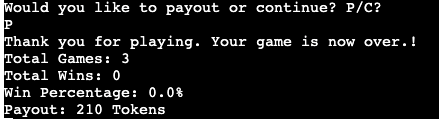

* Special features - E symbol. The manifestation of the 'E' symbol bestows participants with bonus tokens or even a rare additional spin. This element introduces a transformative potential to the dynamics of the game and injects an additional layer of excitement.

## Features Left to Implement

* Local storage
* Scoring system
* Two player option

---

## Design

* Colors
    no-colors

* Flowchart
    * [Lucidchart](https://www.lucidchart.com/)

---

## Technologies Used

* [Python](https://en.wikipedia.org/wiki/Python_(programming_language))

---

## Frameworks, Libraries & Programs Used

* [Visual Studio Code](https://code.visualstudio.com/)
    * To write the code.
* [Git](https://git-scm.com/)
    * for version control.
* [Github](https://github.com/)
    * Deployment of the website and storing the files online.
* [Lucidchart](https://www.lucidchart.com/)
    * To create a logic flowchart of the hangman game.
* [Heroku](https://www.heroku.com/)
    * To deploy the project.
* [CI Python Linter](https://pep8ci.herokuapp.com/)
    * Check code for any issues.

## Testing 

CI Python Linter was used to test run.py, colors.py and hangman_art_words.py

 run.py CI Python Linter check

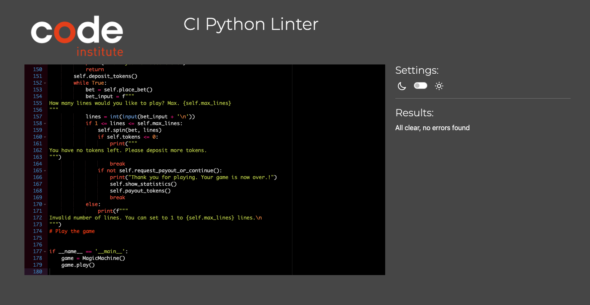

## Manual Testing

The game was manually tested extensively using VScode terminal, and once the website was deployed on Heroku it was manually tested again, during the creation of the code to the end. Testing of rules display, user input validation, using differnt inputs to break code, correct and incorrect answers and finally win or lose display and play again feature.

| Feature | Expected Result | Steps Taken | Actual Result | Screenshot |
| ------- | -------------- | ----------- | ------------- | ---------- |
| Intro Screen   | To display rules and welcome message | None | As Expected |  |
| Display Rules | To display rules and use either "A" or "D" to contiue or leave game | Input "A" agree, input "D" to disagree | As Expected |  |
| Deposit Token | To display question how much to deposit | Input number | As Expected | |
| Stake amount | To put in the amount of tokens, the player want to use | Input number | As Expected |  |
| Amount of lines/rows | To display the number of lines, the player wager | Input number | As Expected |  |
| Game Results| To display the rows and symbols | None | As Expected |  |
| Play again or payout  | Prompts user to decided to contiue or end the game | Input a letter  "P" or "C"| As Expected |  |
| Path "C" Contiue with game | To display stake amount question | Input number| As Expected |  |
| Game statitics  | To display game count, wins and win percentage | None | As Expected | |
| Special bonus  | To display letter "E" or extra spin | None | As Expected |  |

## Input validation testing

| Feature | Expected Result | Steps Taken | Actual Result | Screenshot |
| ------- | -------------- | ----------- | ------------- | ---------- |
| Display Rules | To display rules and use either "A" or "D" to contiue or leave game | Input number, other letter or empty input| Invalid input - Must be "A" or "D"| 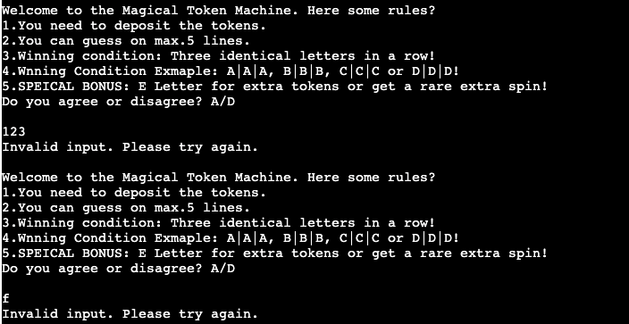|
| Deposit Token | To display question how much to deposit | Input decialmal number, special character or letter| Invalid Input - Must be an integer and greater an 0 | 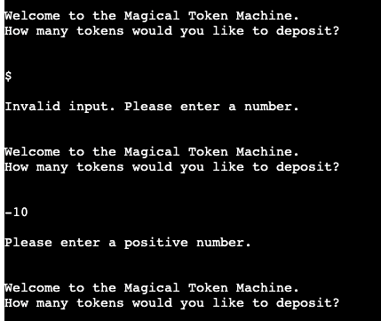|
| Stake amount | To put in the amount of tokens, the player want to use | Input intgers,special character or letter |Invalid input - Must a number between 1 and ammount of deposit | 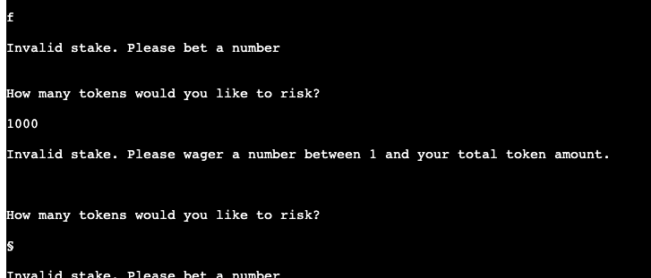|
| Amount of lines/rows | To display the number of lines, the player wager | Input intgers over 5, special character and letter| Invalid Input - Must be intger between 1 and 5| 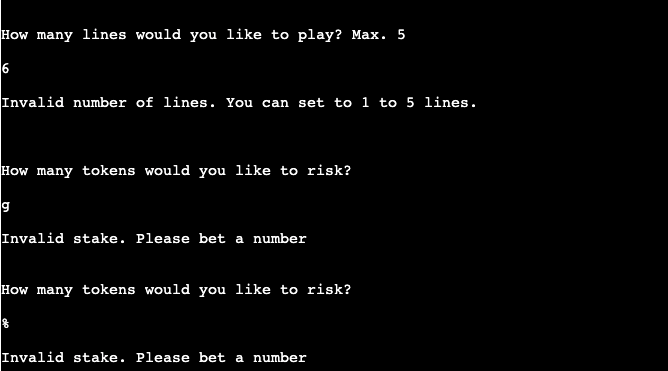|
| Play again or payout  | Prompts user to decided to contiue or end the game | Input Input intgers,special character or letter| Invalid Input - Must be letter "C" or "P"| 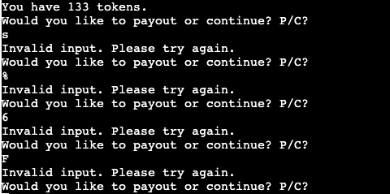 |

## Fixed Bugs

* Initially, the application was hindered by syntax errors that disrupted its smooth operation. Through meticulous code analysis and rigorous testing, these errors were identified and rectified. This intervention has significantly improved the reliability and performance of the application, ensuring that commands are interpreted and executed as intended. 
* A particularly challenging bug was identified in the initial deployment, where the multiplication of tokens did not function correctly. This issue was critical, as it directly affected the core functionality of the application. Through a thorough examination of the underlying algorithms and logic, the bug was successfully isolated and fixed, restoring the integrity of the token multiplication feature and ensuring accurate transaction processing.

## Deployment

### Deploying to Heroku

To deploy with Heroku, Code Institute Python Essentials Template was used so the python code can be viewed in a terminal in a browser
1. Log in to Heroku or create a new account
2. On the main page click "New" and select "Create new app"
3. Choose your unique app name and select your region
4. Click "Create app"
5. On the next page find "settings" and locate "Config Vars"
6. Click "Reveal Config Vars" and add "PORT" key and value "8000", click "Add"
7. Scroll down, locate "Buildpack" and click "Add", select "Python"
8. Repeat step 7. only this time add "Node.js", make sure "Python" is first
9. Scroll to the top and select "Deploy" tab
10. Select GitHub as deployment method and search for your repository and link them together
11. Scroll down and select either "Enable Automatic Deploys" or "Manual Deploy"
12. Deployed site [Magical Token Machine](https://magical-token-machine-fbea0bb744c9.herokuapp.com/)

### Forking the GitHub Repository

By forking the repository, we make a copy of the original repository on our GitHub account to view and change without affecting the original repository by using these steps:

1. Log in to GitHub and locate [GitHub Repository magicaltokenmachine](https://github.com/neaqx/magicaltokengame)
2. At the top of the Repository(under the main navigation) locate "Fork" button.
3. Now you should have a copy of the original repository in your GitHub account.

### Local Clone

1. Log in to GitHub and locate [GitHub Repository magicaltokenmachine](https://github.com/neaqx/magicaltokengame)
2. Under the repository name click "Clone or download"
3. Click on the code button, select clone with HTTPS, SSH or GitHub CLI and copy the link shown.
4. Open Git Bash
5. Change the current working directory to the location where you want the cloned directory to be made.
6. Type `git clone` and then paste The URL copied in the step 3.
7. Press Enter and your local clone will be created.

## Credits

### Code

* I gained understanding of python through code institute lessons.
* I gained more python concepts through Python for begginers written by Brady Ellison.
* Project Insperation from [YT](https://www.youtube.com/watch?v=th4OBktqK1I&t=504s).
* Python 3.11.3 documentation.
* ANSI color documentation.
* MDN web docs for python [Documentation](https://developer.mozilla.org/en-US/docs/Glossary/Python).

### Content

* The Magical Token Machine.
* All content was written by the developer.

## Acknowledgements

 * My mentor Mitko Bachvarov provided helpful feedback.
 * Slack community for encouragement.